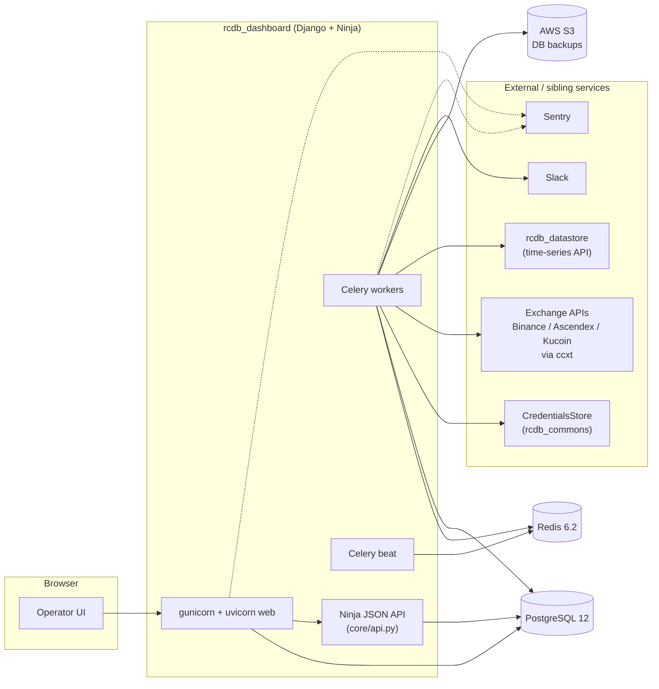

# rcdb_dashboard

> Django operations console for the RCDB multi-exchange automated trading platform.

[](https://www.python.org/)
[](https://www.djangoproject.com/)
[](https://docs.celeryq.dev/)
[](https://www.postgresql.org/)
[](https://docs.docker.com/compose/)
[](#lineage)

**Archived** - cloned from `hcmc-project/rcdb_dashboard` for posterity. Part of the **RCDB** automated trading platform, later merged into [3Jane Technologies](https://github.com/3jane).

---

## Table of contents

- [What this was](#what-this-was)
- [Tech stack](#tech-stack)
- [Key models](#key-models)
- [Background tasks](#background-tasks)
- [Supported exchanges and account tiers](#supported-exchanges-and-account-tiers)
- [Architecture](#architecture)
- [Operations](#operations)
- [Lineage](#lineage)
- [Sibling repos](#sibling-repos)

## What this was

`rcdb_dashboard` was the operations and monitoring console for the RCDB multi-exchange automated trading platform. It centralized exchange credentials across many account tiers, surfaced live USD-aggregated balance snapshots, tracked rolling volume statistics, and exposed per-bot equity, exposure, and PnL for the live trading fleet.

It is a Django 3.1 application backed by PostgreSQL and Redis, with Celery workers running scheduled jobs that pull live balances and trades from exchange APIs (via [ccxt](https://github.com/ccxt/ccxt)) and pull historical aggregates from the platform's internal `rcdb_datastore` time-series API. Secrets live in an external credential vault (`rcdb_commons.lib.stores.CredentialsStore`); the dashboard never holds raw API secrets at rest. Errors stream to Sentry via the Django and Celery integrations.

Behind the UI sits a Ninja-based JSON API (`core/api.py`) used by sibling RCDB services for credential lookups, strategy config reads, and per-account status checks, gated by a JWT `HttpBearer` against `is_staff` users.

## Tech stack

| Layer | Tools |
|---|---|
| Web framework | Django 3.1.7, `django-ninja`, `django-json-widget`, `whitenoise` |
| API server | Gunicorn + Uvicorn workers (ASGI), nginx in front |
| Task queue | Celery 5.0.5 with Redis broker + result backend; `celery beat` for cron |
| Database | PostgreSQL 12 |
| Cache / broker | Redis 6.2 |
| Exchange clients | `ccxt` (Binance, Ascendex via custom subclass, Kucoin) |
| Data | `pandas`, `numpy`, `pyarrow`, `tables`, on-disk Feather trade files |
| Auth | Django auth + `pyjwt` bearer tokens for the Ninja API |
| Observability | `sentry-sdk` (Django + Celery integrations) |
| Packaging | Docker, Docker Compose, AWS ECR (`deploy.sh`) |
| Cloud | AWS S3 (DB backups via `boto3`) |
| Tests | `pytest`, `pytest-django`, `pytest-mock` |

## Key models

Defined in [`core/models.py`](core/models.py):

- `Owner` - groups exchange credentials under a single accounting entity; computes per-owner totals (USD balance, borrowed, interest, 1h/24h/7d volume) via aggregate queries on JSONB fields.
- `Exchange` - registry of supported venues (binance, ascendex, kucoin).
- `Currency` / `Symbol` / `Instrument` - reference data; `Symbol` exposes `to_ccxt`, `to_binance`, `to_kaiko` formatters.
- `ExchangeCredentials` - the central record. Holds `account_type`, `meta`, JSONB `balance_snapshot` + `statistics` payloads, `balance_snapshot_clean` / `statistics_clean` projections for cheap aggregation, per-account Feather trade file path, `ignore_balance` / `ignore_datapipes` flags. Margin detection via `is_margin` property.
- `Bot` - strategy instance; `config` JSONB validated on save against `rcdb_commons.lib.schemas.strategy_configs.AdminConfigInput` (pydantic).
- `BotStatistic` - time-series row per bot: equity, exposure, employed capital, fair / forex / crypto prices, borrowed base/quote. Computes `price_change` and `price_deviation`.
- `TradingStatus` - global kill switch singleton (`id=0`) toggling `is_trading_allowed` for the whole platform.

## Background tasks

Scheduled via Celery beat in [`rcdb_execution/settings.py`](rcdb_execution/settings.py), implemented in [`core/tasks.py`](core/tasks.py). All long-running tasks use a Redis-backed `RedisSimpleLock` to prevent overlap.

| Task | Cadence | Purpose |
|---|---|---|
| `t_schedule_update_account_statistics` | every 2 min | Fans out per-credential `t_update_account_statistics` jobs as a Celery `group` for every Binance account with `meta`, gated by `LOCK_SCHEDULE_UPDATE_STATISTIC`. |
| `t_update_account_statistics` | on-demand | Pulls trades from `DataStore` and refreshes the per-credential `statistics` JSON. |
| `t_balance_updater` | every 2 min | Async coroutine (`balance_updater`) that rotates credentials, fetches balances per account type via the `AccountConnector` hierarchy, computes USD totals, and writes `balance_snapshot`. Uses `BINANCE_PROXIES` pool and a `GracefulKiller`. |
| `t_update_accounts_pnl` | every 5 min | Walks transfers from `DataStore` and recomputes per-account PnL. |
| `t_backup_db` | daily, 00:00 UTC | `S3DBDumper` dumps the Postgres DB to the `rcdb-backups` S3 bucket. |
| `t_volumes_notify` | hourly | `VolumeNotificator` posts/updates a Slack message in `SLACK_CHANNEL` with platform-wide volume stats. |
| `t_schedule_update_bot_statistic` / `t_update_bot_statistic` | on-demand | `BotStatisticUpdater` refreshes per-bot equity/exposure/PnL rows (beat entry currently disabled in code). |

## Supported exchanges and account tiers

Account-type handlers are wired in [`core/services.py`](core/services.py) under `AscendexAccountConnector`, `BinanceAccountConnector`, and `KucoinAccountConnector`.

| Exchange | Spot | Cross Margin | Isolated Margin | USDT-M Futures | COIN-M Futures | Main |
|---|---|---|---|---|---|---|
| binance | yes | yes | yes | yes | yes | - |
| ascendex | yes | yes | - | yes | - | - |
| kucoin | yes | yes | - | yes | yes (BTC, ETH, DOT, XRP) | yes |

Notes:

- Binance balance fetches route through a configurable proxy pool (`BINANCE_PROXIES`).
- Ascendex uses a custom `ccxt.ascendex` subclass with `account-category=margin` / `account-category=futures` params.
- Kucoin COIN-M balances iterate over a fixed currency set (`BTC`, `ETH`, `DOT`, `XRP`) and aggregate.
- **Kucoin futures API requires separate credentials.** Create a distinct Kucoin account for futures account types, e.g. `user_main_fut` for `USDT-M Futures` and `COIN-M Futures`, and `user_main` for everything else.

## Architecture



## Operations

### Environment

Required env vars (consumed by `docker-compose.yml` and `rcdb_execution/settings.py`):

- `ENV` (`PROD` disables `DEBUG`), `AWS_DEFAULT_REGION`
- `POSTGRES_HOST`, `POSTGRES_PORT`, `POSTGRES_USER`, `POSTGRES_PASSWORD`, `POSTGRES_DB`
- `REDIS_HOST`, `REDIS_PORT`, `REDIS_PASSWORD`
- `DATASTORE_URL`, `DATASTORE_TOKEN`
- `CREDENTIALSTORE_URL`, `CREDENTIALSTORE_TOKEN`, `CREDENTIALSTORE_VAULT`
- `BINANCE_PROXIES` (comma-separated), `BUCKET_NAME` (S3 backups, default `rcdb-backups`)
- `SENTRY_DSN`, `SLACK_TOKEN`, `SLACK_CHANNEL`
- `DOCKER_REGISTRY` (AWS ECR registry), `CELERY_QUEUE` (default `default`)

### Run locally

```
docker-compose up --build
```

Brings up `nginx`, `web` (gunicorn + uvicorn ASGI), `celery_workers`, `celery_beat`, `db` (Postgres 12, exposed on `5433`), and `redis`.

### Migrations

```
docker-compose run web bash -c "./manage.py migrate"
```

### Deploy

```
./deploy.sh            # pull, restart
./deploy.sh --migrate  # pull, migrate, restart
```

Logs in to AWS ECR, pulls `web` + `nginx` images, restarts the stack with `docker-compose.awslogs.yml` overlay.

### Tests

```
./run-tests.sh
```

Spins up a disposable Postgres 12 on port `5434` and runs `pytest` against [`tests/`](tests/) (`test_api.py`, `test_models.py`, `test_pnl.py`, `test_botstatistc_updater.py`, `test_update_account_statistics.py`).

## Lineage

- Origin: `hcmc-project/rcdb_dashboard` (private)
- Archive: `tartakovsky-archive/rcdb_dashboard` (this repo)
- Successor: [3Jane Technologies](https://github.com/3jane)

## Sibling repos

- [rcdb_commons](https://github.com/tartakovsky-archive/rcdb_commons) - shared client SDKs and schemas
- [rcdb_datastore](https://github.com/tartakovsky-archive/rcdb_datastore) - FastAPI time-series API
- [rcdb_research](https://github.com/tartakovsky-archive/rcdb_research) - quantitative research framework
