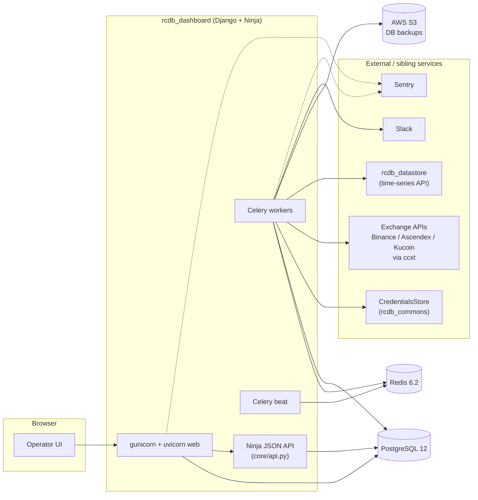

# rcdb_dashboard

> Django ops console for the RCDB trading platform.

[](https://www.python.org/)
[](https://www.djangoproject.com/)
[](https://docs.celeryq.dev/)
[](https://www.postgresql.org/)
[](https://docs.docker.com/compose/)
[](#lineage)

**Archived.** Cloned from `hcmc-project/rcdb_dashboard`. Part of the **RCDB** trading stack. Later folded into [3Jane](https://github.com/3jane).

---

## Table of contents

- [What this was](#what-this-was)
- [Tech stack](#tech-stack)
- [Key models](#key-models)
- [Background tasks](#background-tasks)
- [Supported exchanges and account tiers](#supported-exchanges-and-account-tiers)
- [Architecture](#architecture)
- [Operations](#operations)
- [Lineage](#lineage)
- [Sibling repos](#sibling-repos)

## What this was

The ops UI for the RCDB trading stack. Use it to hold keys, watch live USD sums, track rolling volume, and read per-bot equity and PnL.

The app runs on Django 3.1 with Postgres and Redis. Celery jobs pull live balances and trades via [ccxt](https://github.com/ccxt/ccxt). They also pull rows from `rcdb_datastore`.

Keys sit in a vault (`rcdb_commons.lib.stores.CredentialsStore`). The UI never holds raw keys. Errors go to Sentry.

A Ninja JSON API (`core/api.py`) sits behind the UI. Other RCDB services hit it for keys, configs, and checks. A JWT `HttpBearer` gates it to staff users.

## Tech stack

| Layer | Tools |
|---|---|
| Web | Django 3.1.7, `django-ninja`, `django-json-widget`, `whitenoise` |
| Server | Gunicorn + Uvicorn (ASGI), nginx in front |
| Queue | Celery 5.0.5 on Redis. `celery beat` for cron |
| DB | PostgreSQL 12 |
| Cache | Redis 6.2 |
| Exchange | `ccxt` (Binance, Ascendex via subclass, Kucoin) |
| Data | `pandas`, `numpy`, `pyarrow`, `tables`, Feather trade files on disk |
| Auth | Django auth plus `pyjwt` bearer for the Ninja API |
| Logs | `sentry-sdk` (Django and Celery) |
| Pack | Docker, Docker Compose, AWS ECR (`deploy.sh`) |
| Cloud | AWS S3 (DB backups via `boto3`) |
| Tests | `pytest`, `pytest-django`, `pytest-mock` |

## Key models

All defined in [`core/models.py`](core/models.py).

| Model | Role |
|---|---|
| `Owner` | Groups exchange keys under one entity. Sums USD balance, borrowed, interest, and 1h / 24h / 7d volume from JSONB |
| `Exchange` | Venue list: binance, ascendex, kucoin |
| `Currency`, `Symbol`, `Instrument` | Reference data. `Symbol` has `to_ccxt`, `to_binance`, `to_kaiko` writers |
| `ExchangeCredentials` | Core row. Holds `account_type`, `meta`, JSONB `balance_snapshot` and `statistics`, and `*_clean` cuts. Trade Feather path. Flags: `ignore_balance`, `ignore_datapipes`. Prop: `is_margin` |
| `Bot` | Strategy row. `config` JSONB is checked on save vs `AdminConfigInput` |
| `BotStatistic` | Per-bot time row. Holds equity, exposure, used capital, fair / fx / crypto prices, base and quote borrows. Adds `price_change` and `price_deviation` |
| `TradingStatus` | Global kill switch (`id=0`). Toggles `is_trading_allowed` for the whole stack |

## Background tasks

Run by Celery beat. Coded in [`core/tasks.py`](core/tasks.py), wired in [`rcdb_execution/settings.py`](rcdb_execution/settings.py). Long jobs use a Redis `RedisSimpleLock` to stop overlap.

| Task | Cadence | Purpose |
|---|---|---|
| `t_schedule_update_account_statistics` | every 2 min | Fans out per-key jobs as a Celery `group`. Lock: `LOCK_SCHEDULE_UPDATE_STATISTIC` |
| `t_update_account_statistics` | on-demand | Pulls trades from `DataStore`. Rewrites the per-key `statistics` JSON |
| `t_balance_updater` | every 2 min | Async. Rotates keys, pulls per-type balances via `AccountConnector`, sums USD, writes `balance_snapshot`. Uses `BINANCE_PROXIES` |
| `t_update_accounts_pnl` | every 5 min | Walks transfers from `DataStore`. Redoes per-account PnL |
| `t_backup_db` | daily, 00:00 UTC | `S3DBDumper` dumps Postgres to the `rcdb-backups` S3 bucket |
| `t_volumes_notify` | hourly | Posts global volume to a Slack thread in `SLACK_CHANNEL` |
| `t_schedule_update_bot_statistic`, `t_update_bot_statistic` | on-demand | Rewrites per-bot rows. Beat entry off in code |

## Supported exchanges and account tiers

Wired in [`core/services.py`](core/services.py) via the per-venue `AccountConnector` types.

| Exchange | Spot | Cross Margin | Isolated Margin | USDT-M Futures | COIN-M Futures | Main |
|---|---|---|---|---|---|---|
| binance | yes | yes | yes | yes | yes | - |
| ascendex | yes | yes | - | yes | - | - |
| kucoin | yes | yes | - | yes | yes (BTC, ETH, DOT, XRP) | yes |

Notes:

| Venue | Note |
|---|---|
| Binance | Routes balance pulls through `BINANCE_PROXIES` |
| Ascendex | Custom `ccxt.ascendex` subclass. Sets `account-category=margin` or `account-category=futures` |
| Kucoin COIN-M | Sums a fixed set: `BTC`, `ETH`, `DOT`, `XRP` |
| Kucoin futures | **Own keys.** Split the Kucoin account: `user_main_fut` for USDT-M and COIN-M, `user_main` for the rest |

## Architecture



## Operations

### Environment

Env vars used by `docker-compose.yml` and `rcdb_execution/settings.py`:

| Group | Vars |
|---|---|
| Mode | `ENV` (`PROD` turns off `DEBUG`), `AWS_DEFAULT_REGION` |
| Postgres | `POSTGRES_HOST`, `POSTGRES_PORT`, `POSTGRES_USER`, `POSTGRES_PASSWORD`, `POSTGRES_DB` |
| Redis | `REDIS_HOST`, `REDIS_PORT`, `REDIS_PASSWORD` |
| Datastore | `DATASTORE_URL`, `DATASTORE_TOKEN` |
| Vault | `CREDENTIALSTORE_URL`, `CREDENTIALSTORE_TOKEN`, `CREDENTIALSTORE_VAULT` |
| Exchange | `BINANCE_PROXIES` (CSV), `BUCKET_NAME` (S3 backups, default `rcdb-backups`) |
| Alerts | `SENTRY_DSN`, `SLACK_TOKEN`, `SLACK_CHANNEL` |
| Deploy | `DOCKER_REGISTRY` (AWS ECR), `CELERY_QUEUE` (default `default`) |

### Run locally

```
docker-compose up --build
```

Starts: `nginx`, `web` (gunicorn + uvicorn), `celery_workers`, `celery_beat`, `db` (Postgres 12 on `5433`), `redis`.

### Migrations

```
docker-compose run web bash -c "./manage.py migrate"
```

### Deploy

```
./deploy.sh            # pull, restart
./deploy.sh --migrate  # pull, migrate, restart
```

Logs in to AWS ECR, pulls `web` and `nginx`, and restarts via `docker-compose.awslogs.yml`.

### Tests

```
./run-tests.sh
```

Starts a throwaway Postgres 12 on `5434`. Runs `pytest` over [`tests/`](tests/).

## Lineage

- Origin: `hcmc-project/rcdb_dashboard` (private)
- Archive: `tartakovsky-archive/rcdb_dashboard` (this repo)
- Successor: [3Jane Technologies](https://github.com/3jane)

## Sibling repos

- [rcdb_commons](https://github.com/tartakovsky-archive/rcdb_commons) - shared client SDKs and schemas
- [rcdb_datastore](https://github.com/tartakovsky-archive/rcdb_datastore) - FastAPI time-series API
- [rcdb_research](https://github.com/tartakovsky-archive/rcdb_research) - quantitative research framework
